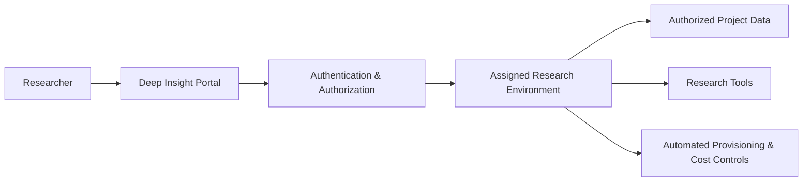

[← Back to Portfolio](../README.md)

# Deep Insight — Secure Research Computing Platform

**Role:** Research Software / Cloud Engineer

**Organization:** Reactor Lab, Iowa State University

**Focus:** Secure research computing · AWS · SageMaker · Data governance · Research infrastructure

## At a Glance

**Problem:** Researchers needed SageMaker and restricted research data, but broad AWS Console access created security, project-isolation, usability, and cost concerns.

**My Role:** Served as the lab's single point of contact for AWS infrastructure while helping design and operate the research-computing platform.

**Solution:** Built controlled access workflows using authentication, project-specific authorization, SageMaker, S3/IAM, Lambda, automated data provisioning, and compute lifecycle management.

**Impact:** Reduced researchers' need to interact directly with AWS infrastructure, improved project/data isolation and usability, and helped reduce unnecessary SageMaker compute cost by approximately **30%**.


---

## The Problem

Our researchers needed AWS SageMaker to analyze sensitive research data and run machine-learning workloads.

The simplest approach was to give researchers access to the AWS Console and let them open their SageMaker environments directly.

That worked technically, but it created a much larger problem.

Researchers belonged to different projects, and those projects contained different restricted datasets. A researcher working on one project should not be able to browse another project's data, inspect another researcher's environment, or freely move sensitive research data onto a personal computer.

There was also a usability problem.

Many researchers were domain experts rather than AWS or Linux experts. Asking every researcher to understand the AWS Console, IAM, S3 paths, command-line tools, notebook lifecycle management, and cloud-resource shutdown was creating unnecessary complexity.

The real question became:

> **How can we give researchers the computing power of SageMaker while hiding unnecessary AWS complexity and preserving isolation between researchers, projects, environments, and restricted data?**

---

# My Role

I became the lab's **single point of contact for AWS-related research infrastructure**.

My responsibilities included:

* Researcher onboarding
* SageMaker environment setup
* IAM roles and policies
* S3 access control
* Cloud troubleshooting
* Research-data access
* Cost-management automation
* AWS debugging and operational support

I also worked on extending **Deep Insight**, our research-computing platform, so researchers could use these resources through a controlled application rather than navigating AWS directly.

---

# Solution 1 — Remove the AWS Console From the Researcher Workflow

Instead of giving researchers normal AWS Console access, we built a portal through which authenticated researchers could enter their assigned SageMaker environments.

### Before

```text
Researcher
    ↓
AWS Console
    ↓
Browse AWS resources
    ↓
Find SageMaker
    ↓
Open notebook
```

This exposed more of the AWS environment than most researchers needed.

### After

```text
Researcher
    ↓
Deep Insight
    ↓
Secure login
    ↓
Researcher / project authorization
    ↓
Assigned SageMaker environment
```

Researchers could access the computing environment they needed without using the AWS Console as their primary interface.

### Technology

* Next.js
* TypeScript
* AWS Cognito
* DynamoDB
* AWS Lambda
* SageMaker
* S3
* IAM
* AWS Amplify

Cognito handled authentication, while application and project information helped determine which resources a researcher should be able to use.

SageMaker-generated access URLs allowed the application to direct researchers into their assigned environment without requiring normal AWS Console navigation.

---

# Solution 2 — Isolate Project Data

Removing the AWS Console was only part of the solution.

Researchers still needed access to data stored in S3.

Different projects contained different datasets, so access could not simply be granted at the entire bucket level.

I created IAM/S3 access policies that restricted researchers and research environments to the folders required for their projects.

Conceptually:

```text
Researcher A
    ↓
Project A SageMaker
    ↓
Project A S3 data only


Researcher B
    ↓
Project B SageMaker
    ↓
Project B S3 data only
```

I also created separate locations for researchers to save outputs and findings so that their work could remain isolated from unrelated projects.

The goal was to keep research data inside controlled cloud workflows rather than distributing copies of sensitive datasets across researchers' personal systems.

---

# Solution 3 — Make Data Access Usable for Non-Linux Users

Once access was secured, another problem became obvious.

Many researchers were not comfortable using commands such as the AWS CLI or Linux shell tools to locate and copy their data from S3.

Requiring every researcher to learn infrastructure commands just to start an experiment was unnecessary friction.

For smaller datasets — roughly below 5 GB — I used **SageMaker lifecycle configurations** to automatically copy the required project data into the notebook environment when the instance started.

The researcher could simply open the notebook and begin working.

```text
Start SageMaker
      ↓
Lifecycle configuration runs
      ↓
Authorized data retrieved from S3
      ↓
Research environment ready
```

For larger datasets, automatically copying everything at startup was not practical.

Instead, we provided a script/workflow that allowed researchers to locate the data they required through database information and retrieve only what was necessary.

The important decision was that **one data-access strategy did not fit every dataset size**.

---

# Solution 4 — Stop Paying for Forgotten SageMaker Instances

SageMaker instances are billed while they are running.

Researchers occasionally finished working but forgot to shut their instances down.

That meant the lab continued paying for idle compute.

I implemented an idle-shutdown mechanism.

A shutdown script was stored in S3 and provisioned to the SageMaker environment through the lifecycle configuration. It then ran periodically through `cron` and detected instances that had remained idle long enough to be stopped.

```text
SageMaker starts
      ↓
Lifecycle configuration
      ↓
Idle-detection script retrieved
      ↓
Cron periodically checks activity
      ↓
Idle instance detected
      ↓
Automatic shutdown
```

This automation helped reduce SageMaker compute costs by approximately **30%**.

---

# Solution 5 — Make Deep Insight the Entry Point to Research Tools

SageMaker was not the only tool researchers used.

The lab already had services such as:

* CVAT on EC2
* RStudio Server on EC2

I integrated access to these existing environments into Deep Insight.

Instead of remembering multiple services and access points, researchers could use one platform as the entry point to the tools available to them.

This also gave us a more centralized view of research-resource access.

---

# A Separate Challenge — Displaying Private Video Frames in Tableau

One of the more unusual problems involved visualization.

We had approximately **15 TB of research video data**.

For analysis, frames were extracted at approximately **1 FPS** and stored in S3.

Researchers wanted to view those images alongside analytical information inside Tableau dashboards.

That created a security and architecture problem.

### Why the obvious options did not work

The S3 bucket contained sensitive research imagery.

Making the bucket public simply so Tableau could display an image was not acceptable.

Using additional analytical services for every image access could also introduce unnecessary cost.

But Tableau could display images when provided with image URLs and could work with data coming from PostgreSQL.

That gave me another approach.

---

# Building an Image-Serving Proxy

I created a lightweight PHP service running on EC2.

After image extraction, each frame was associated with a generated URL, and those URLs were stored with the analytical information in PostgreSQL.

The request flow became:

```text
Tableau
    ↓
Image URL stored in PostgreSQL
    ↓
EC2 PHP server
    ↓
Extract requested filename
    ↓
Determine S3 object location
    ↓
Retrieve image from private S3
    ↓
Return image to Tableau
```

This allowed Tableau to display the required imagery while keeping the underlying S3 storage private.

---

# Finding the Next Security Problem

The proxy solved the S3 problem but introduced another question:

> What happens if someone obtains one of those image URLs?

If the EC2 server were reachable from anywhere, possession of a URL could provide unintended access to an image.

I therefore restricted inbound access to the proxy using approved IP addresses.

Authorized addresses could be added or removed from the EC2 network configuration as required.

This project taught me an important security lesson:

> **Solving one security boundary can create another boundary that also needs to be examined.**

---

# Security Hardening — Removing Credentials From the Browser

Another important lesson came during development of Deep Insight itself.

I discovered that AWS credentials being supplied through frontend environment configuration could become exposed in the deployed client.

I treated that as a credential-exposure incident.

My immediate actions were to:

1. Revoke/delete the exposed credentials.
2. Stop the deployed Amplify application.
3. Investigate which AWS operations actually required privileged access.
4. Redesign the application so the browser no longer held reusable AWS credentials.
5. Deploy the corrected architecture with new credentials where still required.

The original architecture effectively allowed:

```text
Browser + AWS credentials
        ↓
Privileged AWS operations
```

I moved privileged operations behind Lambda:

```text
Browser
    ↓
Application request
    ↓
AWS Lambda
    ↓
IAM-authorized SageMaker / S3 operation
```

Lambda received only the AWS permissions required for the operations it performed.

Other AWS-hosted resources used IAM-based access wherever possible.

The experience changed how I thought about cloud application trust boundaries: **frontend configuration should never be treated as a secure place for privileged secrets.**

---

# Large-Scale Research Data Behind the Platform

The AWS environment also supported research projects involving large amounts of heterogeneous data.

For one project, the raw information included:

* GPS
* Gyroscope and other sensor measurements
* Driver information
* Vehicle information
* Trip information
* Roadway properties
* Speed limits
* Road type
* Participant-related research variables

These sources existed across many files and systems.

Researchers needed a consistent dataset they could query instead of repeatedly joining and preprocessing raw files themselves.

I built data-processing workflows that aligned the sources at approximately **one-second resolution** and stored the integrated results in PostgreSQL.

One analytical table grew to approximately:

* **30 million rows**
* **60+ columns**
* **100+ participants**

I created a similar research dataset for another project that exceeded **70 million rows**.

Database permissions were configured so research teams could access only the data associated with their projects.

The objective was not simply to create large tables.

The goal was to transform fragmented raw research data into **analysis-ready datasets** that researchers could query directly.

---

# Automating On-Premises → AWS Data Transfer

Another recurring problem involved transferring large research datasets from a TrueNAS server at another location into AWS.

The original workflow involved manual Windows/WinSCP-style transfers and additional steps to move the data into cloud storage.

That approach was tedious and difficult to maintain.

I researched TrueNAS's cloud synchronization capabilities and found that it could connect directly to AWS.

After configuration and validation, the transfer became a scheduled nightly synchronization:

```text
TrueNAS
    ↓
Scheduled cloud sync
    ↓
AWS S3
```

This removed a recurring manual data-movement process.

---

# Operating the Environment

Building the platform was only part of my work.

I also supported researchers using it.

Because I was the **single point of contact for AWS in the lab**, issues often came to me first.

### Example — “SageMaker doesn't have enough RAM”

A researcher reported that their SageMaker instance was repeatedly crashing despite using an instance with substantial memory.

Simply moving to a larger and more expensive instance would have been an easy assumption.

Instead, I investigated the behavior and determined that the actual problem was a **memory leak in the researcher's code**.

The infrastructure was not the root cause.

### Example — accidental data deletion

In another case, a researcher accidentally deleted a file and could no longer locate it.

I helped investigate the storage environment and recover the missing data.

These incidents reinforced that operating research infrastructure requires understanding both **cloud systems and the applications researchers run on them**.

---

# High-Level Architecture

The public diagram is intentionally simplified; the platform used AWS services and access controls behind these layers to isolate researchers, data, and computing environments.



---

# Technical Stack

**Frontend / Application**

Next.js · TypeScript

**Authentication / Authorization**

AWS Cognito · IAM · S3 policies

**Cloud**

AWS SageMaker · Lambda · S3 · EC2 · DynamoDB · Amplify

**Data**

PostgreSQL · multi-source ETL / transformation workflows

**Infrastructure / Automation**

SageMaker lifecycle configurations · cron · TrueNAS cloud synchronization

**Visualization**

Tableau · PHP image-serving proxy

---

# Results

The work changed the research environment from one in which researchers needed to interact directly with AWS infrastructure into one where much of that complexity was managed by the platform.

The resulting environment provided:

* Reduced dependence on AWS Console access
* Researcher/project data isolation
* More controlled S3 access
* Automatic data provisioning
* Easier workflows for researchers unfamiliar with Linux/AWS CLI
* Isolated locations for research outputs
* Approximately **30% reduction in unnecessary SageMaker compute cost**
* Centralized access to SageMaker, CVAT, and RStudio
* Private Tableau visualization of S3-hosted research imagery
* Analysis-ready PostgreSQL datasets containing tens of millions of records
* Automated nightly movement of research data from TrueNAS into AWS

---

# What I Learned

Deep Insight changed the way I think about software engineering.

The hardest problems were rarely about knowing which AWS button to click.

They were about understanding the constraint behind the request.

A researcher asking:

> “How do I download this S3 folder?”

might actually need:

> “How can this platform automatically give me the correct data without requiring me to understand S3?”

A request to:

> “Give researchers SageMaker access”

might actually require solving:

> authentication, authorization, project isolation, sensitive-data access, usability, cost management, and operational support.

The project taught me to think about systems from the user's problem outward rather than starting with the technology.

It also taught me that production systems evolve through failure: credential exposure, idle compute, difficult data retrieval, inaccessible visualization, and software crashes all led to better architecture.

---

# What This Project Demonstrates

**Cloud architecture**
Designing workflows across SageMaker, Lambda, S3, EC2, Cognito, DynamoDB and Amplify.

**Security and authorization**
Project-based access, IAM policies, credential remediation, network restrictions and data isolation.

**Backend / platform engineering**
Creating controlled service boundaries between user-facing applications and privileged cloud operations.

**Data engineering**
Turning fragmented research sources into PostgreSQL datasets containing tens of millions of records.

**Infrastructure automation**
Lifecycle configurations, automated provisioning, idle shutdown and scheduled storage synchronization.

**Production ownership**
Researcher onboarding, debugging, troubleshooting and day-to-day AWS operations.

**User-centered engineering**
Removing infrastructure complexity so researchers could concentrate on their research rather than learning AWS administration.


---

[← Back to Portfolio](../README.md)
