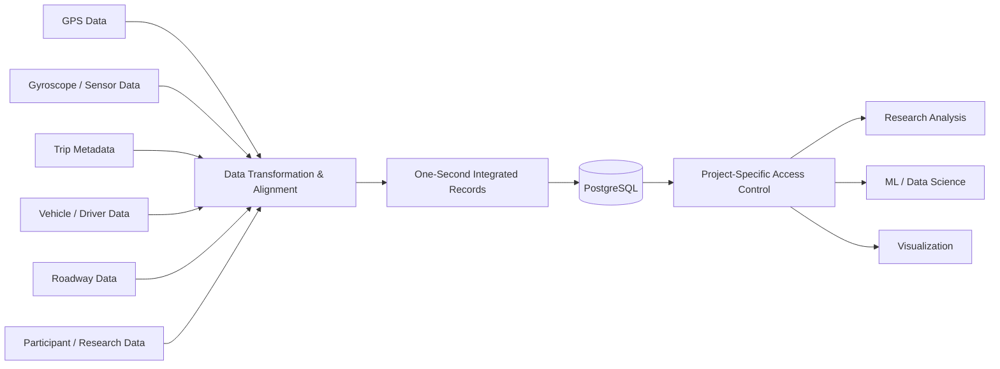

[← Back to Portfolio](../README.md)

# Large-Scale Research Data Integration — From Fragmented Sensor Files to Analysis-Ready Data.

**Role:** Data Engineer / Research Software Engineer
**Organization:** Iowa State University — Reactor Lab
**Focus:** ETL · PostgreSQL · Sensor Data · Temporal Alignment · Research Data Infrastructure

---

## The Problem

Several research projects in our lab collected data from many different sources describing the same participant, vehicle, and trip.

The data included information such as:

* GPS
* Gyroscope and other sensor measurements
* Driver / participant information
* Vehicle information
* Trip metadata
* Roadway information
* Speed limits
* Road type
* Additional project-specific participant variables

The problem was that these sources did not arrive as one clean analytical dataset.

They existed across many files and data sources.

Before a researcher could answer a question, they first had to determine:

* Which files belonged to the participant?
* Which files belonged to the same trip?
* How should timestamps be aligned?
* Which roadway record corresponded to that moment?
* Which participant and vehicle metadata applied?
* How should the different sampling rates and sources be combined?

Researchers were spending significant effort preparing data before they could begin the actual analysis.

The goal became:

> **Can we transform fragmented raw research data into one consistent, queryable representation that researchers can use directly?**

---

# The Core Challenge — Aligning Different Data Sources Over Time

The different sources described related events, but they were not naturally represented as one table.

For example, at a particular point during a trip we might want to know:

```text
Timestamp
   ↓
GPS location
   +
vehicle / trip
   +
sensor measurements
   +
roadway type
   +
speed limit
   +
participant information
```

The common dimension connecting much of the information was **time**.

I therefore designed the processing workflow around approximately **one-second resolution**.

Conceptually:

```text
Raw sensor files
       +
GPS data
       +
Trip / vehicle metadata
       +
Roadway information
       +
Participant data
       ↓
Cleaning and transformation
       ↓
Timestamp alignment
       ↓
One-second records
       ↓
Unified analytical table
```

This converted many disconnected inputs into a longitudinal representation of what was happening during each trip.

---

# Building the Analytical Dataset

I developed the data-transformation workflow and PostgreSQL structure required to combine the sources.

For one research project, the resulting analytical table contained approximately:

**30 million rows**

with more than:

**60 columns**

covering more than:

**100 participants**

Each row represented an approximately one-second view of the relevant trip and research information.

Instead of repeatedly opening and joining raw files, researchers could query a consistent database table.

---

# Why This Was More Than a Large SQL Table

The important part was not the row count.

The table represented the result of several data-engineering decisions:

* aligning different data sources,
* preserving relationships between participants, trips and vehicles,
* joining roadway context,
* maintaining temporal consistency,
* organizing dozens of variables into a usable schema,
* and making the resulting dataset practical for downstream analysis.

Without that layer, every research project could end up implementing its own version of the same preprocessing.

The unified database created a reusable analytical foundation.

---

# A Second Large Research Dataset

I later built a similar processing and storage workflow for another research project involving a different set of sensitive participant data.

That dataset was even larger.

The resulting PostgreSQL table grew beyond:

**70 million rows**

with a large number of analytical attributes.

Although the specific research variables differed, the underlying challenge was similar:

> **turn heterogeneous raw research data into a consistent database that researchers could query efficiently.**

This showed that the approach could be applied beyond a single dataset or experiment.

---

# Security Was Part of the Database Design

Because these were sensitive research datasets, usability was not the only concern.

Different researchers and projects should not automatically gain access to one another's data.

I therefore implemented PostgreSQL access controls so that research teams could access only the tables or data resources associated with their authorized projects.

The goal was:

```text
Research Team A
       ↓
Authorized Project A data


Research Team B
       ↓
Authorized Project B data
```

rather than:

```text
Any database user
       ↓
All research data
```

This extended the lab's project-isolation model beyond AWS/S3 and into the analytical database itself.

---

# From Raw Data to Research Questions

Before the transformation:

```text
Many files
+ different data sources
+ timestamps
+ metadata
+ repeated joins
+ repeated preprocessing
        ↓
Researcher must prepare everything first
```

After the transformation:

```text
Analysis-ready PostgreSQL table
        ↓
SQL / analytical query
        ↓
Research investigation
```

The value was reducing the amount of infrastructure and preprocessing work required before researchers could begin the work they were actually interested in.

---

# Supporting Downstream Analytics

Once the data existed in a consistent database representation, it could support workflows such as:

* Driver-behavior analysis
* Trip-level investigation
* Vehicle analysis
* Roadway-context analysis
* Car-following research
* Visualization
* Statistical analysis
* Machine-learning feature generation

This made the database a shared research asset rather than a dataset prepared for only one experiment.

---

# Data Flow

The final portfolio can use a cleaner visual diagram, but the basic structure was:



---

# My Contribution

My work included:

* Understanding the different research data sources
* Designing how the sources should be combined
* Building data-transformation workflows
* Aligning data at approximately one-second resolution
* Integrating sensor, trip, vehicle, roadway and participant information
* Designing PostgreSQL analytical tables
* Handling tens of millions of resulting records
* Supporting tables with 60+ analytical fields
* Implementing project-specific database permissions
* Preparing data for downstream research and analysis
* Supporting researchers using the resulting datasets

---

# Scale

### Dataset 1

* **100+ participants**
* **~30 million rows**
* **60+ columns**
* Multiple sensor, roadway, participant and trip-related sources

### Dataset 2

* **70+ million rows**
* Large multi-source research dataset
* Similar transformation into analysis-ready PostgreSQL form

The portfolio does not need to expose the sensitive project-specific variables.

The important point is the scale and integration challenge.

---

# What I Learned

This work reinforced that data science often begins long before a model is trained.

The difficult questions were things such as:

> Which records actually refer to the same event?

> How should sources with different structures be aligned?

> What should one database row represent?

> Which information should be repeated versus normalized?

> How can the resulting dataset remain useful to multiple research questions?

> Who should be allowed to query which data?

A sophisticated model is not useful if the underlying data is inconsistent or prohibitively difficult to access.

---

# What This Project Demonstrates

### Data Engineering

Transforming heterogeneous raw data into a consistent analytical representation.

### Temporal Data Integration

Aligning multiple information sources at one-second resolution.

### Large-Scale Relational Data

Working with PostgreSQL datasets containing tens of millions of records and dozens of analytical attributes.

### Schema & Data Modeling

Designing tables around downstream analytical requirements rather than merely mirroring source files.

### Research Infrastructure

Building reusable data resources that support multiple researchers and analytical workflows.

### Data Governance

Applying project-specific database permissions to sensitive research data.

### Research Enablement

Reducing repeated preprocessing so researchers can spend more time investigating scientific questions.


---

[← Back to Portfolio](../README.md)
