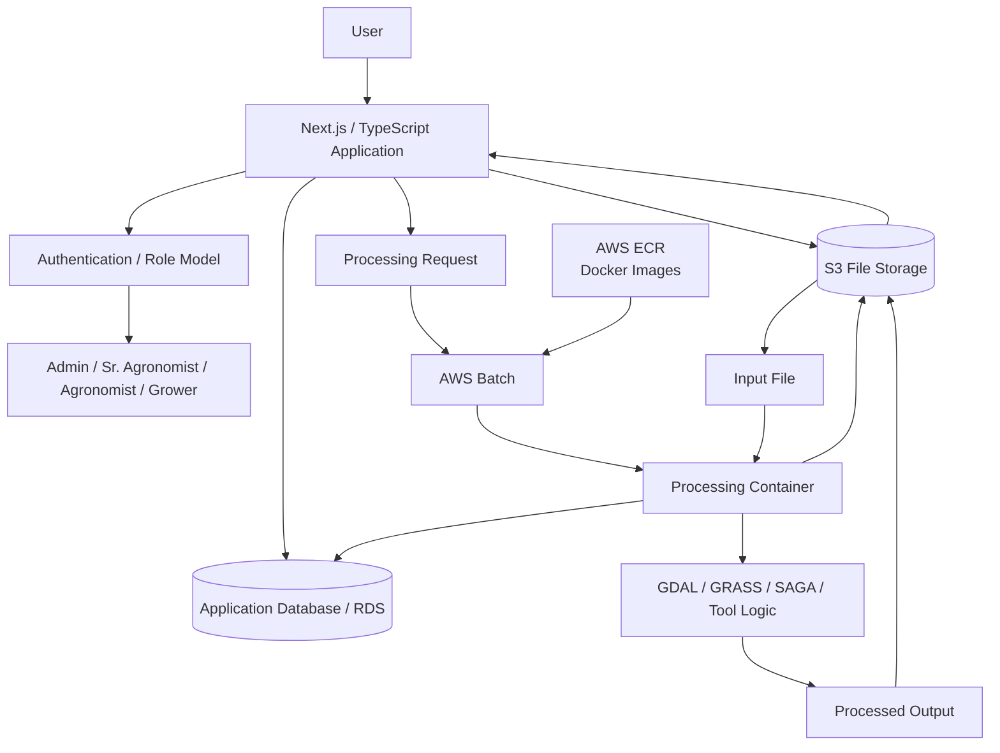

[← Back to Portfolio](../README.md)

# SoilSerdem — Cloud Data Processing & Full-Stack Platform

**Role:** Full-Stack / Cloud Software Engineer

**Organization:** SoilSerdem

**Period:** April 2024 – December 2024

**Focus:** Full-stack development · Cloud processing · Docker · AWS · Data-science tooling · RBAC · CI/CD

## At a Glance

**Problem:** Users needed to run complex scientific and GIS processing tools through a simple web workflow without installing the software or managing cloud infrastructure themselves.

**My Role:** Worked across the full stack — application development, data modeling, Docker environments, AWS infrastructure, processing orchestration, deployment, and production debugging.

**Solution:** Containerized scientific tools and connected the web application to S3, RDS, ECR, AWS Batch, and VPC-based infrastructure so processing could run on demand.

**Result:** Users could upload data, select a processing tool, launch cloud-based processing, and retrieve results while the underlying infrastructure remained hidden behind the application.


---

## The Problem

SoilSerdem needed more than a traditional web application.

Its users needed to work with scientific and geospatial processing tools without installing complex software environments or understanding the infrastructure required to run them.

From the user's perspective, the desired workflow was simple:

```text
Upload data
    ↓
Choose a processing tool
    ↓
Click Process
    ↓
Wait for processing
    ↓
Receive results
```

But the tools themselves had substantial dependencies, required isolated processing environments, consumed data stored in S3, and needed cloud compute that should exist only while a job was running.

The application also evolved from a relatively simple product into one with:

* Multiple organizational roles
* Hierarchical user relationships
* File storage
* Cloud job execution
* Scientific processing
* Role-specific interfaces
* Authentication
* Database-backed job state
* Automated deployment

My work grew with that evolution.

---

# Phase 1 — Building the Public Website

My first responsibility was to build SoilSerdem's informational website.

I developed approximately seven pages using:

* Next.js
* TypeScript
* Responsive web components
* Image carousel functionality
* Contact Us integration using AWS SES

Most of the pages were straightforward.

The more interesting engineering problem appeared when the application had to be deployed.

---

# Deployment Constraint — A 1 GB Server Could Not Build the Application

I selected a small AWS EC2 instance for hosting because it was sufficient for serving the website and kept infrastructure cost low.

My initial deployment pipeline attempted to build the Next.js application on the EC2 server itself.

```text
GitHub
   ↓
GitHub Actions
   ↓
EC2
   ↓
npm build
   ↓
Deploy
```

The deployment repeatedly failed.

The problem was not the application itself.

The EC2 instance had only approximately **1 GB of RAM**, and the production build was consuming more resources than the machine could reliably provide.

One solution would have been to increase the EC2 instance size.

Instead, I changed where the expensive operation happened.

---

# Moving the Build Out of Production

I redesigned the CI/CD pipeline so **GitHub Actions performed the build**, while EC2 was responsible only for running the resulting application.

```text
GitHub push
     ↓
GitHub Actions
     ↓
Build Next.js application
     ↓
Package production artifacts
     ↓
Transfer artifacts to EC2
     ↓
PM2 starts/restarts application
     ↓
NGINX serves application
```

The production server no longer needed enough memory to compile the application.

It only needed enough resources to run it.

I also configured:

* **PM2** for Node.js process management
* **NGINX** as the reverse proxy
* **Let's Encrypt through Certbot** for HTTPS
* Domain/DNS configuration for the production website

This resulted in a working GitHub-to-production CI/CD workflow while retaining the small EC2 instance.

The important lesson was:

> **A deployment problem does not always require more infrastructure. Sometimes the better solution is to move the workload to the stage where it belongs.**

---

# Phase 2 — Extending the Existing Application

After the website work, I began modifying SoilSerdem's application itself.

One early feature was adding support for **tilling-related functionality**.

Although the feature was relatively small, it required changes across multiple layers:

```text
Database / Prisma schema
       ↓
Backend API
       ↓
TypeScript application logic
       ↓
Material UI components
```

This gave me experience modifying an existing application's data model rather than building only isolated frontend features.

---

# Building File Uploads

The next requirement was file handling.

Users needed to upload specific types of input files that would later be used by the scientific processing tools.

I implemented the workflow so that:

```text
User selects file
       ↓
File type validated
       ↓
File uploaded
       ↓
File information stored in application database
```

This became the foundation for the much larger processing system that followed.

The file was no longer just an attachment.

It became an input artifact that could later be selected and passed into a scientific processing job.

---

# Phase 3 — Containerizing Scientific / GIS Tools

The next challenge was much more substantial.

SoilSerdem had several data-science and GIS processing tools that needed to run through the application.

The tools depended on a complex software environment.

Typical dependencies included:

* Ubuntu 22.04
* GDAL
* GRASS GIS
* SAGA GIS
* AWS CLI
* Tool-specific libraries and configurations

Building a reliable environment took significant experimentation because the dependencies were heavy and needed to coexist correctly.

I ultimately created Docker environments for **four processing tools**.

---

# Defining a Common Processing Contract

The containers needed to work as part of a cloud system rather than simply run on my development machine.

I structured them around a common processing pattern:

```text
Input stored 
       ↓
Container starts
       ↓
Input retrieved
       ↓
Scientific / GIS processing executes
       ↓
Output generated
       ↓
Output stored back 
```

I tested the containers locally first.

Once the environments and processing workflows worked correctly, I pushed the images to **AWS Elastic Container Registry (ECR)**.

The real value of Docker here was not simply containerization.

It provided:

* Reproducible processing environments
* Dependency isolation
* Consistent execution
* Portability from local development to cloud compute
* A standard unit of execution for the processing platform

---

# Phase 4 — Turning the Containers Into an On-Demand Service

The client did not want users interacting with Docker, AWS, or command-line tools.

The desired product experience remained simple:

```text
Upload file
   ↓
Select file
   ↓
Select processing tool
   ↓
Click Process
   ↓
Receive result
```

Making that interaction simple required significantly more engineering behind the scenes.

At this point, the system involved:

* Web frontend
* Application backend
* S3
* RDS-backed application data
* ECR
* AWS Batch
* VPC networking
* Dockerized scientific tools

---

# Designing the Processing Flow

When the user clicked **Process**, several things had to happen correctly.

The application needed to know:

* Which user submitted the job
* Which input file had been selected
* Which processing tool had been selected
* Where the file existed in S3
* Which container image should execute
* Where results should be written
* When processing completed

The resulting workflow became approximately:

```text
User
  ↓
Selects uploaded file + processing tool
  ↓
Processing request stored in database
  ↓
Batch job launched
  ↓
Container starts/job/file information/get file
  ↓
Processing code executes
  ↓
Output written
  ↓
Container exits
  ↓
Batch compute terminates
  ↓
Result becomes available to application/user
```

---

# Making the Containers Application-Aware

The original containers knew how to execute their scientific tools.

That was not enough.

To function as workers inside the platform, I had to modify their logic so they could:

1. Connect to the relevant application/database information.
2. Identify the correct job and input file.
3. Determine the S3 location of the file.
4. Download the correct input.
5. Run the appropriate scientific processing workflow.
6. Write the resulting files to the appropriate S3 output location.
7. Exit cleanly when processing completed.

The container became more than a packaged scientific program.

It became an **ephemeral processing worker** within a larger distributed system.

---

# Networking the System

Another challenge was making the different AWS resources communicate correctly.

The processing workflow depended on connectivity between components including:

* AWS Batch
* RDS
* S3
* Application services
* ECR
* Resources operating inside or through the VPC

I worked through the VPC and service-access configuration so that the Batch processing jobs could communicate with the resources they required without treating the system as a collection of independent services.

This was one of the areas where the project required substantial experimentation, configuration, and debugging.

---

# Why AWS Batch Was Useful

The processing tools could require substantially more resources than the website itself.

Keeping a permanently running high-powered server just in case someone submitted a job would have been inefficient.

Instead, Batch allowed processing resources to be used when work actually existed.

Conceptually:

```text
No processing job
      ↓
No processing compute required

User submits job
      ↓
Compute starts
      ↓
Container processes data
      ↓
Job completes
      ↓
Compute terminates
```

This separated the requirements of the web application from the requirements of the scientific processing workload.

---

# Phase 5 — The Application's Role Model Changed

The application initially had a much simpler user model.

The client later defined four organizational roles:

```text
Admin
  ↓
Senior Agronomist
  ↓
Agronomist
  ↓
Grower
```

This was not simply a matter of adding four labels.

The roles represented hierarchical relationships.

### Admin

Administrators needed full access to the system and its users.

### Senior Agronomist

Each Senior Agronomist was responsible for specific Agronomists and needed visibility into:

* Their assigned Agronomists
* The Growers belonging to those Agronomists

### Agronomist

Each Agronomist could access only the Growers assigned to them.

### Grower

Growers represented the lowest level of the organizational relationship and interacted only with the parts of the platform relevant to their role.

---

# Redesigning the Data Model

Supporting those rules required changes to the underlying application structure.

I redesigned the **Prisma schema and relational model** to represent the organizational relationships between users.

Conceptually:

```text
Admin
 ├── Senior Agronomist A
 │      ├── Agronomist A1
 │      │      ├── Grower 1
 │      │      └── Grower 2
 │      │
 │      └── Agronomist A2
 │             └── Grower 3
 │
 └── Senior Agronomist B
        └── ...
```

The UI also needed to respect these relationships.

A Senior Agronomist should not simply receive the same page as an Admin with some buttons hidden.

The data being loaded itself needed to reflect the user's position in the hierarchy.

---

# Introducing Authentication and Registration

The existing application did not have an authentication flow suitable for maintaining these relationships.

That made it difficult to reliably answer questions such as:

* Who is this user?
* Which role do they have?
* Which Senior Agronomist or Agronomist are they associated with?
* Which users should they be allowed to see?

I implemented login/registration functionality and incorporated role information into the onboarding process.

That gave the system a consistent identity from which the organizational relationships could be established.

---

# Grower Invitation Workflow

I also added functionality allowing an **Agronomist to invite Growers by email**.

This helped establish the relationship during onboarding rather than requiring an administrator to manually construct every association afterward.

The broader lesson was that role-based access is not only an authorization problem.

It is also an **identity and relationship-management problem**.

---

# Phase 6 — Designing an Automated File Processing Workflow

As the processing platform grew, we wanted to automate more of what happened after users uploaded files.

One challenge was determining which type of data had been uploaded and therefore which processing workflow should be used.

Before implementing the complete automation, I created a **flowchart for the end-to-end lifecycle**.

That helped answer questions such as:

* What happens immediately after upload?
* How is the file identified?
* Which processing tool should receive it?
* When should processing start?
* What if classification fails?
* Who needs to intervene?
* What state should be stored?
* What does the user see when something goes wrong?

---

# Start With the Happy Path, Then Model Failure

My development approach was to first define the expected path:

```text
File uploaded
     ↓
File type/category identified
     ↓
Correct processing tool selected
     ↓
Processing launched
     ↓
Result produced
```

Then I began introducing the situations that could break that path.

For example:

```text
File uploaded
     ↓
Automatic classification attempted
     ↓
Unable to determine category
     ↓
???
```

We developed a script that attempted to determine which tool/category an uploaded file belonged to.

However, automated classification was not always reliable.

So the architecture needed a fallback.

The intended workflow became:

```text
Automatic classification succeeds
        ↓
Continue automatically


Automatic classification fails
        ↓
Alert administrator
        ↓
Administrator determines correct category
        ↓
Processing continues
```

I designed this fallback, although the final administrator-resolution feature was **not completed before my internship ended**.

I consider that distinction important.

The architecture accounted for the failure condition, but I do not claim that every part of the fallback workflow reached production.

---

# Production Incident — “It Works Locally”

One of the most useful debugging experiences happened during deployment of the role-related changes.

Locally, the application worked.

The frontend deployment also succeeded.

But the production application still did not function correctly.

That initially made the issue difficult to understand.

---

# Following the Logs Instead of the Symptoms

I investigated the deployment logs and discovered that the **backend deployment had failed**, even though the frontend build had completed.

The failure was related to Prisma/database state and the user-role relationships used during development.

My local environment contained test users, roles, and relationship data that allowed the application to work correctly.

The production database did not have an equivalent valid state for the new relationships.

The resulting process was approximately:

```text
Application works locally
       ↓
Production deployment begins
       ↓
Frontend succeeds
       ↓
Backend fails
       ↓
Application appears broken
       ↓
Inspect deployment logs
       ↓
Identify Prisma / database relationship issue
       ↓
Roll back
       ↓
Correct database state / relationship problem
       ↓
Redeploy
```

This was a useful reminder that:

> **“Works locally” proves the application works with the local environment. It does not prove the production environment contains the same assumptions.**

---

# Draft Architecture Overview

The final portfolio will use a cleaner visual diagram, but the logical architecture was approximately:



The final visual version should emphasize the simplicity seen by the user versus the orchestration happening behind the application.

---

# From the User's Perspective

The goal of the platform was to make this:

```text
Upload
→ Choose tool
→ Process
→ Get result
```

feel simple.

The infrastructure required to make that interaction possible included:

```text
Next.js
+ TypeScript
+ Application APIs
+ Relational data model
+ Authentication
+ Hierarchical RBAC
+ S3
+ RDS
+ Docker
+ ECR
+ AWS Batch
+ VPC networking
+ Scientific / GIS software
+ CI/CD
+ EC2
+ NGINX
+ PM2
```

The complexity belonged behind the platform, not with the user.

---

# Technical Stack

### Application

Next.js · TypeScript · Material UI · Node.js / Express · Prisma

### Data

Relational database / AWS RDS · S3

### Scientific Processing

Docker · GDAL · GRASS GIS · SAGA GIS · AWS CLI

### Cloud Processing

AWS ECR · AWS Batch · VPC · S3 · RDS

### Deployment

AWS EC2 · GitHub Actions · PM2 · NGINX · Let's Encrypt · Certbot

### Communication

AWS SES

---

# What I Personally Owned

Across the project, my work included:

* Building the public Next.js website
* Implementing production CI/CD
* Diagnosing the low-memory EC2 build failure
* Moving production builds into GitHub Actions
* Configuring PM2, NGINX, HTTPS and EC2 hosting
* Adding full-stack application features
* Modifying Prisma schemas
* Building file-upload workflows
* Integrating S3 storage
* Containerizing four scientific/GIS tools
* Solving complex GIS software dependency issues
* Testing container workflows locally
* Publishing images to ECR
* Integrating containers with RDS/job information
* Building the S3 → processing → S3 execution workflow
* Configuring AWS Batch processing
* Working through VPC/service connectivity
* Redesigning the application for hierarchical roles
* Implementing login/registration
* Creating Grower email invitations
* Building role-specific pages and relationships
* Designing the processing lifecycle through flowcharts
* Developing automatic file-category identification
* Designing manual failure/fallback paths
* Debugging Prisma/database deployment failures

---

# Results

By the end of my work, SoilSerdem had evolved from a conventional web application into a platform capable of connecting user-facing workflows with cloud-hosted scientific computation.

The platform could:

* Accept user-uploaded data
* Persist files in S3
* Track associated application information
* Package complex GIS/data-science environments reproducibly with Docker
* Store processing images in ECR
* Launch processing through AWS Batch
* Retrieve inputs from S3
* Execute scientific workflows
* Write results back to cloud storage
* Shut down processing resources after jobs completed
* Represent hierarchical user relationships
* Present role-specific application views
* Support user registration and invitations
* Deploy application changes through automated CI/CD

---

# What I Learned

The most important lesson from SoilSerdem was that a feature that appears simple in the UI can represent a large systems problem underneath.

“Let the user select a tool and click Process” required solving:

* Packaging
* Networking
* Identity
* Storage
* Compute
* Database state
* Job execution
* Failure handling
* User experience

It also reinforced the importance of designing around failure.

The useful questions were not only:

> What should happen when processing works?

but also:

> What if the file cannot be classified?

> What if the backend deployment fails while the frontend succeeds?

> What assumptions exist locally that production does not have?

> What happens to compute after the job finishes?

> Who is allowed to see which users and data?

Those questions shaped the system as much as the happy-path requirements did.

---

# What This Project Demonstrates

### Full-Stack Engineering

Working across the UI, APIs, application logic, relational models, authentication and storage.

### Backend / Distributed Systems

Turning a synchronous-looking user action into an asynchronous cloud processing workflow involving multiple services.

### Cloud Architecture

Integrating EC2, S3, ECR, Batch, RDS and VPC networking.

### Containers & ML/Data Infrastructure

Packaging complex scientific environments and turning containers into reusable cloud workers.

### Data Modeling & Authorization

Designing hierarchical relationships and role-aware application behavior.

### DevOps

Creating CI/CD workflows, diagnosing production deployment failures and operating a resource-constrained server environment.

### Debugging

Tracing failures across application, database, deployment and infrastructure layers rather than assuming the visible symptom identified the root cause.

### Product Thinking

Keeping the user's workflow simple while moving infrastructure complexity behind the application.


---

[← Back to Portfolio](../README.md)
