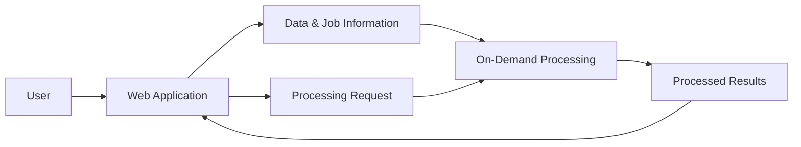

[← Back to Portfolio](../README.md)

# SoilSerdem — Cloud Data Processing Platform

**Role:** Full-Stack / Cloud Software Engineer

**Organization:** SoilSerdem

**Period:** April 2024 – December 2024

## At a Glance

**Problem:** Users needed to run complex scientific and geospatial processing tools through a simple web application without installing or managing the underlying software and computing infrastructure.

**My Role:** Worked across application development, data modeling, containerization, cloud processing, deployment, role-based access, and production debugging.

**Solution:** Helped turn standalone scientific tools into an on-demand processing workflow where users could upload data, select a processing tool, initiate a job, and later retrieve the generated results.

**Result:** The infrastructure complexity remained behind the application while users interacted with a much simpler workflow.

---

## The Problem

The desired user experience sounded straightforward:

```text
Upload data
    ↓
Choose a processing tool
    ↓
Process
    ↓
Receive results
```

Making that interaction simple required substantially more engineering behind the scenes.

The scientific tools had complex software dependencies, required more computing resources than the website itself, and needed to read user data, execute processing, save results, and terminate cleanly after the work was complete.

The application also evolved to require authentication, hierarchical user relationships, role-specific interfaces, file management, and automated deployment.

---

# Building the Initial Web Application

My first responsibility was developing the company's informational website and deploying it to a production environment.

One interesting problem appeared during deployment.

The production server had limited memory and could serve the application successfully, but it could not reliably perform the application's production build.

Instead of increasing the size of the production server, I redesigned the deployment workflow so that the computationally expensive build occurred in the CI environment.

The production machine then received only the artifacts required to run the application.

Conceptually:

```text
Source code
    ↓
Automated CI build
    ↓
Production artifacts
    ↓
Application server
```

This created a reliable automated deployment workflow while keeping the production environment lightweight.

---

# Extending the Application

I later worked on features that required coordinated changes across:

**user interface → application logic → APIs → relational data model**

I also implemented a file-upload workflow in which user data could be validated, stored remotely, and associated with records in the application database.

That feature became the starting point for the application's larger scientific-processing workflow.

---

# Packaging Scientific Processing Tools

A major challenge was making several scientific and geospatial tools run consistently outside individual development machines.

The scientific processing workflows depended on **resource-intensive geospatial software and native system libraries**, making the runtime environments difficult to reproduce consistently.

I containerized four processing workflows and worked through compatibility and dependency issues across complex geospatial tooling, including technologies such as **GDAL, GRASS GIS, and SAGA GIS**, along with supporting Linux libraries and cloud-access utilities.

I validated each environment locally before integrating it into the broader processing workflow.

The value of containerization was not simply packaging the applications—it created **repeatable, isolated execution environments** for scientific software with substantial system-level dependencies.


Each processing unit followed the same high-level contract:

```text
Retrieve input
     ↓
Execute scientific processing
     ↓
Generate output
     ↓
Persist results
```

This provided consistent execution and isolated the scientific dependencies from the rest of the application.

---

# Turning Processing Tools Into a User-Facing Service

The next challenge was connecting those processing environments to the web application.

When a user clicked **Process**, the platform needed to determine:

* which user submitted the request,
* which file was selected,
* which processing workflow was required,
* where the input existed,
* where results should be stored,
* and when processing had completed.

The high-level workflow became:

```text
User
  ↓
Web Application
  ↓
Processing Request
  ↓
On-Demand Processing
  ↓
Result Storage
  ↓
Web Application
  ↓
User
```

The processing environment retrieved the correct input, executed the selected scientific workflow, saved the resulting output, and terminated after completion.

This allowed computationally intensive processing to remain separate from the web application's normal workload.

---

# High-Level Architecture



*This diagram is intentionally simplified and does not reproduce the production infrastructure or internal system configuration.*

---

# Hierarchical Access Control

The application later needed to support users with different levels of organizational responsibility.

That required more than showing different buttons to different users.

I redesigned the underlying relationships so that the data available to a user reflected their position within the organizational hierarchy.

The work included:

* redesigning relational data structures,
* introducing authentication and registration,
* creating role-specific interfaces,
* representing parent/child user relationships,
* and supporting invitation-based onboarding.

This reinforced that access control is not only a UI problem.

It is also a **data-modeling and identity problem**.

---

# Designing the Processing Lifecycle

As the platform evolved, we wanted to automate more of what happened after users uploaded data.

I created a flowchart describing the lifecycle from upload through processing and result generation.

I first modeled the successful path:

```text
Upload
   ↓
Identify processing requirement
   ↓
Launch processing
   ↓
Generate result
```

Then I considered what could fail.

One experimental automation attempted to determine the appropriate processing path automatically.

Because that decision could sometimes be ambiguous, I also designed a fallback in which an administrator could intervene.

The final manual-resolution workflow was not completed before my internship ended.

I keep that distinction explicit because designing a capability and deploying it are not the same thing.

---

# Production Debugging — When Local Success Was Misleading

One deployment created a particularly useful debugging experience.

The application worked locally and part of the production deployment completed successfully, but the complete system did not function correctly.

Rather than debugging only the visible frontend behavior, I inspected the deployment logs and found that a backend deployment step had failed because the production database state did not match assumptions present in my development environment.

The recovery process was:

```text
Observe production failure
       ↓
Inspect deployment logs
       ↓
Identify environment/data mismatch
       ↓
Roll back
       ↓
Correct database state
       ↓
Redeploy
```

This reinforced an important lesson:

> **“Works locally” verifies the development environment, not the production environment.**

---

# What I Personally Worked On

My responsibilities across the project included:

* Building and deploying web applications
* Implementing automated CI/CD
* Troubleshooting resource-constrained deployments
* Developing full-stack application features
* Modifying relational data models
* Building file-upload workflows
* Containerized four scientific/GIS workflows with complex native geospatial dependencies, including GDAL, GRASS GIS, AWS CLI etc.
* Integrating user-facing applications with on-demand compute
* Designing hierarchical role relationships
* Implementing authentication and onboarding workflows
* Designing processing and failure-handling flows
* Debugging production deployment and database problems

---

# What I Learned

The strongest lesson from SoilSerdem was that a feature that appears simple to a user can represent a large systems problem underneath.

A request such as:

> “Let the user upload a file, choose a tool, and click Process.”

required reasoning about:

**data → compute → identity → storage → job lifecycle → failure handling → user experience**

It also reinforced the value of considering failure paths early.

Useful engineering questions included:

> What happens if processing cannot determine what to do with the input?

> What assumptions exist only in the development environment?

> What happens to compute after the job finishes?

> Which data should each user be allowed to see?

Those questions shaped the system as much as the successful workflow did.

---

# What This Project Demonstrates

**Full-Stack Engineering**
Working across user interfaces, APIs, application logic, relational models, authentication, and data workflows.

**Cloud / Backend Systems**
Turning a simple user request into asynchronous on-demand processing.

**Containerization**
Packaging complex scientific environments into repeatable processing units.

**Data Modeling & Access Control**
Representing hierarchical user relationships and role-aware data access.

**DevOps**
Building automated deployment workflows and troubleshooting production failures.

**Product Thinking**
Keeping complicated infrastructure behind a simple user workflow.

---

[← Back to Portfolio](../README.md)
